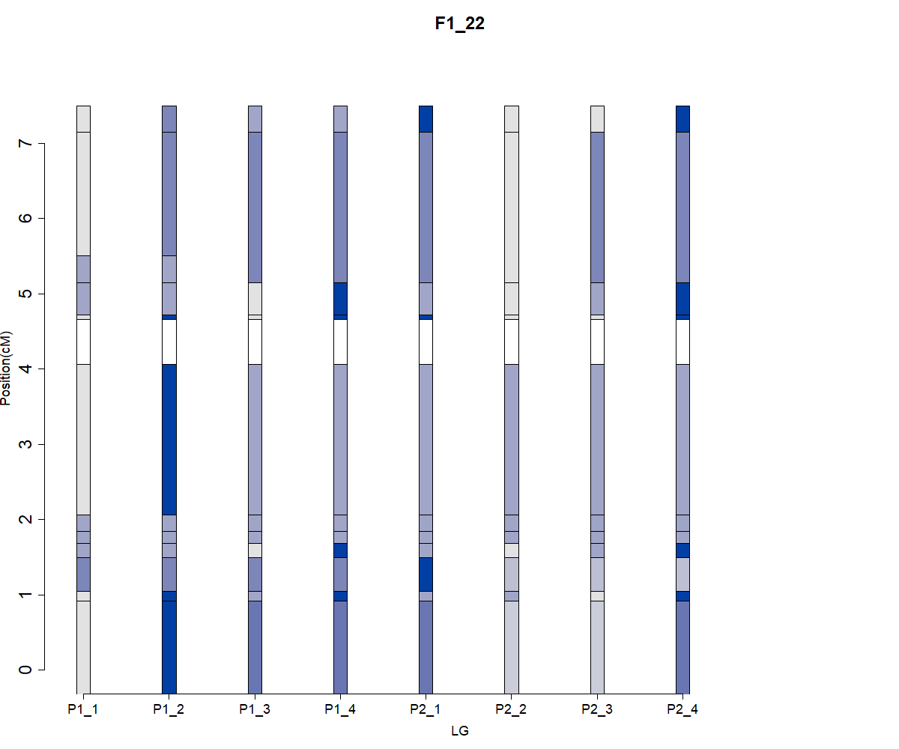

In this tutorial, we will go through the basic steps to perform linkage analysis in polyploids by using multi-allelic markers (haplotypes).  The example dataset is a simulated dataset (by PedigreeSim) of a hypothetical tetraploid outcrossing plant species with one chromosome. It is a F1 population with 200 individuals between two non-inbred parents. Both parents are assumed to follow polysomic inheritance (random bivalent pairing). 


## Table of Contents
1. [Introduction](#sect1)
2. [Load functions](#sect2)
3. [Importing data and specify general terms](#sect3)
4. [Generate equations](#sect4)
5. [Estimate how offspring inherit gametes from parents under assumed inheritance](#sect5)
6. [Perform linkage analysis](#sect6)
7. [Linkage result evaluation](#sect7)
8. [Clustering](#sect8)
9. [Phasing](#sect9)
10. [Ordering](#sect10)
11. [Combine results](#sect11)
12. [Estimate IBD probabilities](#sect12)
13. [References](#sect13)


<a name="sect1"></a>


## 1. Introduction
Linkage analysis is a genetic technique used to understand the segregation of genes and illustrates the recombination landscape within a species, typically derived from a single cross. Tools such as TetraploidSNPMap (Hackett et al., 2017), PolyGembler (Zhou et al., 2017), polymapR (Bourke et al., 2018), MAPpoly (Mollinari and Garcia, 2019), and netgwas (Behrouzi et al., 2019) facilitate linkage analysis using bi-allelic SNP markers. Since alleles within a bi-parental population are inherited in blocks, clustering markers into haploblocks can capture more comprehensive genetic information. A haploblock consists of multiple genomic variants, usually SNPs, within a compact contig where no recombination occurs within the block (Wang et al., 2002). In linkage studies involving two bi-allelic markers, phasing can be categorized as repulsion, coupling, or mixed, with limited capacity to map each allele. By grouping multiple bi-allelic markers into a single unit, or what we can call a multi-allelic marker, haploblocks allow us to map more alleles and directly generate haplotype maps after linkage estimation.

This study introduces a novel approach for estimating recombination frequency and phasing using haplotypes. We demonstrate this approach using an example from a tetraploid F1 population. In the tetraploid context, we denote the unique haplotypes as A, B, C, and D. For a given parent, we can distinguish between different combinations of these haplotypes, such as ABCD, AABB, AABC, and AAAB in an individual.

<a name="sect2"></a>


## 2. Load functions

`mappire` is still under development. To install it, please use this command:
```{r, eval = FALSE,warning=FALSE}
install.packages("mappire_0.1.1.tar.gz")
```

The packages required to run this study include:
```{r, eval = FALSE,warning=FALSE}
library(Deriv); library(combinat);library(dplyr);
library(foreach); library(doParallel);library(randomcoloR); 
library(ggplot2);library(combinat); library(reshape2);
library(doSNOW);library(polymapR);library(MDSMap)
```

<a name="sect3"></a>


## 3. Importing data and specify general terms

First, the ploidy level must be specified based on the input data. The package can run in parallel using multiple cores, depending on your computer's settings. You can define the number of cores you want to use (typically fewer than your maximum capacity). The number of available cores can be checked using the function detectCores(). Before starting, ensure that your working directory is set correctly. This can be done using setwd().

Set the working directory and assign it to a variable called Total_path. Then, specify an appropriate file name for saving your experimental results
```{r, eval = FALSE,warning=FALSE}
ploidy <- 4
cores <- 4
dir.create('example') # create a folder naming as 'example'
setwd('example') #set working directory to the folder of 'example'
```
A dosage table is required, with rows representing markers and columns representing individuals. Missing values should be indicated as 'NA. We begin with an example dataset, created using PedigreeSim (Voorrips & Maliepaard, 2012). This can be uploaded by:
```{r, eval = FALSE,warning=FALSE}
data("dsg_table") 
```
To convert it to the working format, we can:
```{r, eval = FALSE,warning=FALSE}
poly <- format_results(dosages = dsg_table,ncores = cores,ploidy = ploidy,Parent1 = 'P1',Parent2 = 'P2') 
```
In our dataset 'poly', there are different types of markers. Here we can use this to obtain the each marker's marker type, sharing percentage, and give an overview of its distribution.
```{r, eval = FALSE,warning=FALSE}
MT <- MarkerType_Overview(poly = poly,
                          ploidy = ploidy,
                          plot = TRUE)
save(MT,file = 'MT.RData')
```
The notation here for different types of markers becomes different.
1_1_1_1: ABCD; 1_1_2: AABC; 1_3: AAAB; 2_2: AABB. In our dataset, the distribution of the dataset is:

{width=100%}

<a name="sect4"></a>

## 4. Generate equations
In haplotype mapping, we have developed a generalized equation for linkage estimation based on ploidy levels. It is recommended to generate this equation prior to performing the analysis. Here, we can call the following:
```{r, eval = FALSE,warning=FALSE}
tetraploid_equation <- bivalent_equation_generator(ploidy = ploidy)
```
This equation represents the generalized probability of all possible gametes. However, to adapt it to different marker types, it needs to be converted accordingly. This can be done by the following (note that this process may take some time to run). To run this example, you can also upload data by data(all_equations).
```{r, eval = FALSE,warning=FALSE}
all_equations <- all_equations_generator(P1_inheritance = 'Polysomic',
                                         P2_inheritance = 'Polysomic',
                                         MT = MT,
                                         ploidy)
save(all_equations,file = 'all_equations.RData')
data(all_equations) #quickly upload all the generated equations 
```
Here, the *all_equation* includes all gametes possibility equations for P1 and P2 separately, adapted according to their marker types. 

<a name="sect5"></a>


## 5. Estimate how offspring inherit gametes from parents under assumed inheritance
The count of offspring gametes from a parent can be estimated based on the assumed inheritance pattern. For a given parental and offspring genotype combination, we can infer the origin of the offspring alleles. In this tutorial, both parents are assumed to follow polysomic inheritance. By separating the parents, we also enable the possibility of performing analyses for parents with different inheritance patterns (which could be covered in a future tutorial). To estimate the probability of how offspring inherit gametes from their parents, we can use the following function:
```{r, eval = FALSE,warning=FALSE}
offspring_score_list <- Infer_offspring_inheritance(poly =poly,
                                                    ploidy = ploidy,
                                                    P1_inheritance = 'Polysomic',
                                                    P2_inheritance = 'Polysomic')
save(offspring_score_list,file = 'offspring_score_list.RData')
```
The output include a list of all markers. Within each marker,it include the missing_nbr(estimated number of missing individuals), and all possible pairing configuration, with the probability of each gametes.

<a name="sect6"></a>


## 6. Perform linkage analysis

To store our data and plots, we can create two folders:
```{r, eval = FALSE,warning=FALSE}
dir.create('Result_1');dir.create('Plot_1')
```

Then, we can perform the linkage analysis, in our example, we will look at the ABCD_EFGH marker x ABCD_EFGH marker. The linkage can be performed by calling:
```{r, eval = FALSE,warning=FALSE}
Linkage_res <- Haplotype_linkage(Mrk_P = 'ABCD_EFGH',
                                 Mrk_Q = 'ABCD_EFGH',
                                 offspring_score_list = offspring_score_list,
                                 poly = poly,
                                 MT = MT,
                                 cores = cores,
                                 all_equations = all_equations,
                                 pairing = NULL)
saveRDS(Linkage_res,file = paste0('Result_1/ABCD_EFGHxABCD_EFGH.RDS'))
```

The output linkage estimation result includes the markers for two markers, for each marker, their recombination frequency and LOD score, and estimated haplotype phasing. More detailed description of analysis can be found in Haplotype_linkage function annotation in exported_functions.R file. 

<a name="sect7"></a>

## 7. Linkage result evaluation
To evaluate whether our linkage function could give us a good estimates, we first need to upload the simulated files (.gen and .map), which is generated by PedigreeSim.
```{r, eval = FALSE,warning=FALSE}
data('genfile')
data('mapfile')
```
To evaluate the results, we can call:
```{r, eval = FALSE,warning=FALSE}
evaluated_res <- results_evaluation(result = Linkage_res,
                                    genfile = genfile,
                                    mapfile = mapfile,
                                    plot =TRUE,
                                    figurename = 'test',
                                    ploidy = 4)

```
Four figures will be plotted to compare the simulated dataset and the estimated phasing: 1) r vs. LOD, 2) true r vs. estimated r (with phasing correctness categorized into groups), 3) r vs. LOD (for wrongly phased markers), and 4) r vs. LOD (for correctly phased markers).


{width=90%}

<a name="sect8"></a>


## 8. Clustering
To achieve clustering, firstly we need to convert our estimated linkage results to the same format of polymapR. It can be achieved by:
```{r, eval = FALSE,warning=FALSE}
linkage <- linkagelist_to_linkage(linkage_res = Linkage_all)
```
Afterwards, we could use function from polymapR to perform clustering. For more details, please check the section.8 in R package polymapR: https://cran.r-project.org/web/packages/polymapR/vignettes/Vignette_polymapR.html


<a name="sect9"></a>


## 9. Phasing
From the estimated linkage results, we can construct the phasing of these multi-allelic markers. To perform phasing, all pairwise linkages must be estimated first. Using this script, the linkage for all marker types is calculated.This step may take a long time as it involves calculating the linkage for all pairwise markers. To quickly proceed to the next steps, you can upload the results by using: data(Linkage_all). It is also suggested to run in HPC with more cores.
```{r, eval = FALSE,warning=FALSE}
Linkage_all <- Haplotype_linkage_all(offspring_score_list = offspring_score_list,
                                     poly = poly,
                                     MT = MT,
                                     cores = cores,
                                     all_equations = all_equations,
                                     pairing = NULL)
#data(Linkage_all)

```
Afterwards, to obtain the phase, you can run:
```{r, eval = FALSE,warning=FALSE}
Phase <- mphasing(MT,
                  poly,
                  linkage_res = Linkage_all$output,
                  ploidy)
```


<a name="sect10"></a>


## 10. Ordering
The ordering of markers was achieved by running MDSmap from polymapR.In this example, we uses information from one chromosome. 
```{r, eval = FALSE,warning=FALSE}
#convert to the format only with markername, r, LOD
linkage <- linkagelist_to_linkage(linkage_res = Linkage_all)
linkage_filtered <- linkage[linkage$LOD > 3,] #filter out pairs which do not have high LOD score.
linkage_list <- list('LG' = linkage_filtered)
map <- polymapR::MDSMap_from_list(linkage_list)
```


<a name="sect11"></a>


## 11. Combine results
To combine the phasing and ordering results together, we can use:
```{r, eval = FALSE,warning=FALSE}
res <- combine_res(map = map$LG,
                   phase = Phase$phasing_res)
```


<a name="sect12"></a>

## 12. Estimate IBD probabilities
In the last, we estimate IBD probabilities from our results.All plots have been saved in folder 'plotIBD'.
```{r, eval = FALSE,warning=FALSE}
res_IBD <- Find_IBD(offspring_probability = offspring_score_list$output,
                    phasing = Phase$phasing_res,
                    ploidy = ploidy,
                    poly = poly,
                    map = map$LG,
                    plot_directory ='plotIBD/')
```
Here is an example how the plot for one individual looks like:
{width=90%}

<a name="sect13"></a>

## 13. References
1. Behrouzi, Pariya, Danny Arends, and Ernst C Wit. 2017. “Netgwas: An R Package for Network-Based Genome-Wide Association Studies.” arXiv preprint arXiv:1710. https://cran. (July 3, 2019).

2. Bourke, Peter M et al. 2018. “PolymapR - Linkage Analysis and Genetic Map Construction from F 1 Populations of Outcrossing Polyploids” ed. Oliver Stegle. Bioinformatics 34(20): 3496–3502. https://academic.oup.com/bioinformatics/article/34/20/3496/4990829 (April 11, 2019).

3. Hackett, C.A. et al. 2017. “TetraploidSNPMap: Software for Linkage Analysis and QTL Mapping in Autotetraploid Populations Using SNP Dosage Data.” Journal of Heredity 108(4): 438–42.

4. Mollinari, Marcelo, and Antonio Augusto Franco Garcia. 2019. “Linkage Analysis and Haplotype Phasing in Experimental Autopolyploid Populations with High Ploidy Level Using Hidden Markov Models.” G3 (Bethesda, Md.) 9(10): 3297–3314. https://www.biorxiv.org/content/10.1101/415232v2 (July 3, 2019).

5. Voorrips, Roeland E, and Chris A Maliepaard. 2012. “The Simulation of Meiosis in Diploid and Tetraploid Organisms Using Various Genetic Models.” BMC Bioinformatics 13(248).

6. Wang, Ning et al. 2002. “Distribution of Recombination Crossovers and the Origin of Haplotype Blocks: The Interplay of Population History, Recombination, and Mutation.” The American Journal of Human Genetics 71(5): 1227–34. https://www.sciencedirect.com/science/article/pii/S0002929707604182 (September 24, 2019).

7. Zhou, Chenxi et al. 2017. “Assembly Of Whole-Chromosome Pseudomolecules For Polyploid Plant Genomes Using Outcrossed Mapping Populations.” bioRxiv. http://biorxiv.org/content/early/2017/03/22/119271 (October 23, 2019).


